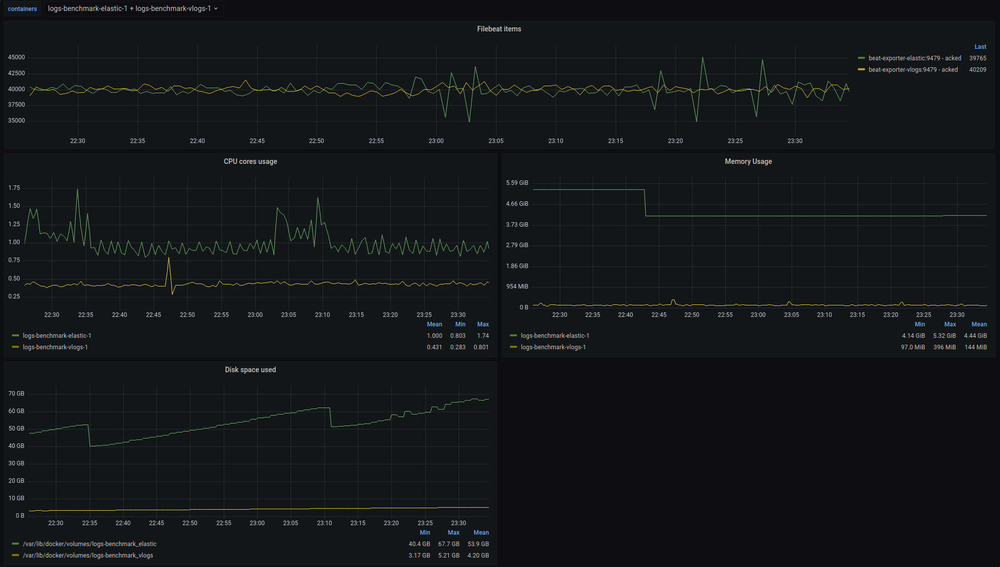
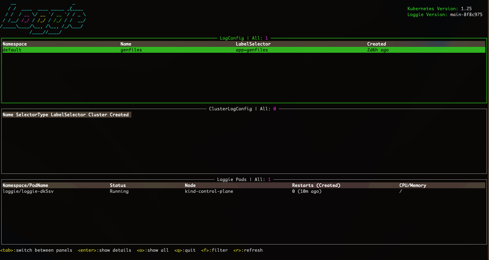
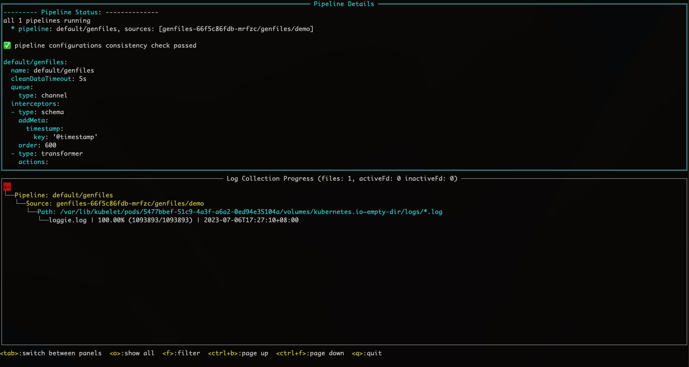
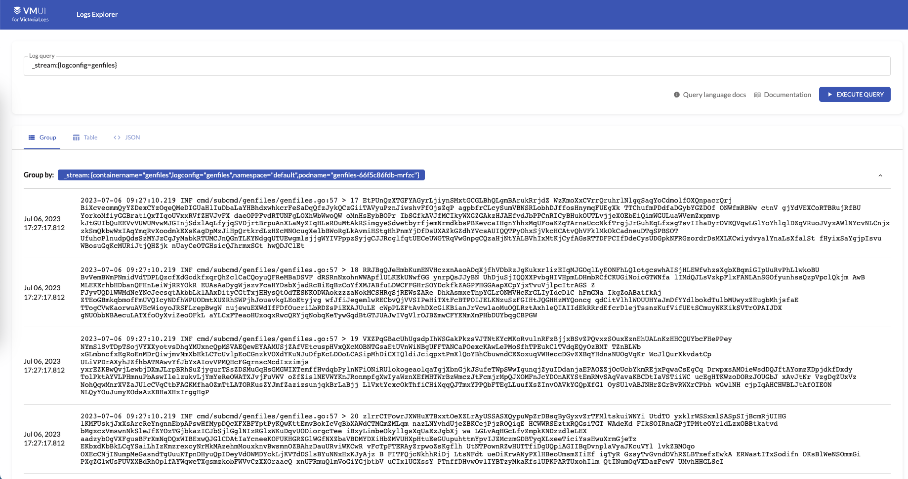

# First experience: Use Loggie and VictoriaLogs to quickly build a new generation of logging system

If you are familiar with Prometheus, you must also know VictoriaMetrics, an increasingly popular monitoring project that can be used as an enhancement or replacement for Prometheus. An important highlight of VictoriaMetrics is to solve the storage problem of Prometheus at the scale of large-scale Metrics indicator data.

Both belong to observability. When we focus on the field of logs, in fact, a pain point of logs for a long time is also storage.

## Basic moments

Some of the more common open source log storage projects nowadays include: Elasticsearch, Clickhouse, Loki, etc. Of course, Elasticsearch and Clickhouse are not inherently designed for log storage, we can just use them to store log data.

For example, the core of Elasticsearch is a search engine. For log storage scenarios, full-text retrieval is a major advantage, but it also has the following shortcomings:

- Write performance is relatively slow
- High resource usage
- Compression difference for log storage

Generally speaking, Elasticsearch is a log storage database with a long history and is widely used. After all, the concept of ELK was deeply rooted in the hearts of the people. However, under the current background of cost reduction and efficiency improvement, many enterprises are still sensitive to the machine resources occupied by Elasticsearch. If it is only used to store a large number of operation and maintenance logs, the cost performance is still low.

Therefore, the emergence of Grafana Loki in the past two years caused a bit of splash. After all, the log field has been suffering from Elasticsearch for a long time.

Let’s briefly introduce the advantages of Loki:

- Designed to store logs
- Resource usage is pretty good
- Introduced the concept of Log Stream

More than half a year ago, a department within our company began to try to use Loki to store some system logs. But there are always some small problems that are not very reassuring. In addition, Loki's shortcomings include:

- There is no actual full-text search, so keyword queries may be slower.
- Setting the retrieved label independently is not supported, which may cause a series of problems such as performance.

Of course, Loki is still a relatively young project, and we can understand that these stability, performance, and design issues may be the pain of early development.

However, it seems that many people can’t wait any longer.

## Long overdue: the advantages of VictoriaLogs

Recently, VictoriaMetrics released a preview version of VictoriaLogs, which is similar to Loki and is specifically used to store logs. In view of VictoriaMetrics' good reputation, everyone still has certain expectations for this "catfish" that will disrupt the situation.

Why did VictoriaMetrics get involved with VictoriaLogs?

In fact, starting from this Issue in 2020：https://github.com/VictoriaMetrics/VictoriaMetrics/issues/816

VictoriaMetrics had the idea to develop VictoriaLogs. From the discussion of this issue, we can see that everyone is still a little bit critical of Loki. For example, storage relies on S3 (local storage does not support distribution), such as performance.

Here is an excerpt from the complaints in issues:

> almost 2 years passed and Loki is still unusable for scenarios with real logging data. Trying to query anything hitting more than 50k logs is exploding servers :)
> 

No need for translation, we can all feel the user’s strong dissatisfaction across the screen.

After more than two years, VictoriaLogs has finally officially arrived in front of us. So what are the advantages of VictoriaLogs and what problems can it solve in the field of log storage?

Here I briefly summarize a few points. Interested students can find more information in [Official Documents]([https://docs.victoriametrics.com/VictoriaLogs/](https://docs.victoriametrics.com/VictoriaLogs/)) Many answers.

- Compatible with Elasticsearch bulk interface
- Support horizontal and vertical expansion
- Low resource usage
- Supports multi-tenancy
- Inherited (copied) Loki's log stream concept, but with some optimizations
- Supports full-text search and provides simple and powerful LogsQL query syntax

Let’s start with a major feature of VictoriaMetrics: **Compatibility**.
VictoriaLogs directly supports the Elasticsearch bulk API. Since almost all log collection agents on the market support sending to Elasticsearch, seamless docking and migration can be achieved without the need for these agents to develop and add new output sources. (I really want to complain about Loki here. It doesn’t even provide a public client SDK package. How can anyone connect with it?)

However, it supports horizontal and vertical expansion. Since the preview version of VictoriaLogs currently only provides single node, it cannot be confirmed yet.

In addition, in terms of **resource usage**, we can directly look at the [benchmark]([https://github.com/VictoriaMetrics/VictoriaMetrics/tree/master/deployment/logs-benchmark](https://github.com/VictoriaMetrics/VictoriaMetrics/tree/master/deployment/logs-benchmark)) results. Comparing Elasticsearch, it can be seen from the figure below:

- average memory
    - Elasticsearch：4.4 GiB
    - VictoriaLogs：144 MiB
- Average disk usage:
    - Elasticsearch：53.9 GB
    - VictoriaLogs：4.20 GB



The memory and disk usage are indeed much lower, basically by an order of magnitude. If the storage capacity is large, it can save a lot of money on the server, which is undoubtedly a great boon for patients who are currently reducing costs and increasing efficiency.

VictoriaLogs also introduces the concept of **log stream**. Combined with the ability of multi-tenants, it seems that it can achieve the optimal solution under the trade-off between performance and resource usage in log storage scenarios. This is why VictoriaLogs differs from Elasticsearch and other non-log-specific log storage scenarios. Stores the core elements of a design database.

So before using VictoriaLogs, be sure to have a good understanding of log stream.

What is log stream?

Simply put, it represents a log instance of the application (service). As for the specific granularity of this log instance, we can design and control it ourselves, but it is not recommended that the overall number is particularly large.

For example, a log instance can be:

- Logs generated by the next Linux process deployed by the host
- Logs generated by the Container container of the Pod running an application on Kubernetes, or more granularly, a log file in the container can also represent a log stream

The key to the design of the log stream is that it can be uniquely identified, so that the location where the log is generated in the distributed system can be determined, such as which log file in which container on which node.

A log stream is identified by multiple labels, so in fact it is similar to the label of Prometheus metrics. We can analogize some concepts in Prometheus:

- job label: indicates applications on multiple copies, such as deployment name
- instance label: Indicates which process and port number generate the metrics

In VictoriaLogs, you can also design some similar labels yourself and add them to the meta-information collected in logs, which can also be used for subsequent correlation and retrieval of logs and indicators. Of course, in actual applications, we can also add labels such as environment, data center, namespace, etc.

If you knew Loki before, you would definitely want to say, didn’t Loki also design the label in this way?

Yes, but after you have used Loki in depth, you may encounter this pitfall: when the log labels sent carry some frequently modified fields, such as a log, the offset field in it is used as a label. It probably looks like this:

```yaml
{
  "message": "xxx",
  "timestamp": "",
  "logconfig": "foo",
  "podname": "bar",
  "offset": 20,
  ...
}
```

Loki will use the values of all labels as a unique log stream identifier. For example, the above content will use `{logconfig: "foo", "podname": "bar", "offset": 20}` as a log stream. Since in the same file, the offset will increase with each line of log collected, this will cause the number of log streams to grow infinitely, causing huge pressure on Loki.

In order to avoid such problems, VictoriaLogs is designed to distinguish stream labels from ordinary labels. For example, in the above scenario, we only need to use logconfig and podname as stream labels, and offset as ordinary labels.

After understanding the stream label, we can better understand the following data formats in VictoriaLogs:

- `_msg`: Log content field
- `_time`: time field
- `_stream` label: In the same log stream, the label remains unchanged
- Ordinary labels: can change in the same log stream, such as level, traceId, etc.

## Real world: Use Loggie to collect logs into VictoriaLogs

Let's start with a real experience of how to use Loggie and VictoriaLogs to quickly build a logging system.

### 1. Deploy VictoriaLogs

The following commands can be executed:

```bash
helm repo add vm https://victoriametrics.github.io/helm-charts/
helm repo update

helm install vlsingle vm/victoria-logs-single -n victoria-logs --create-namespace
```

For more details, please refer to [helm chart deployment](https://github.com/VictoriaMetrics/helm-charts/blob/master/charts/victoria-logs-single/README.md)。

Here we set the deployed namespace to victoria-logs. If the namespace name is modified, please also modify some of the following configurations simultaneously.

### 2. Deploy Loggie

If you don’t know Loggie yet, please go [here]([https://github.com/loggie-io/loggie](https://github.com/loggie-io/loggie))。

For convenience, we provide a deployment configuration adapted to VictoriaLogs in the Loggie catalog.

```bash
VERSION=v1.4.0
helm pull https://github.com/loggie-io/installation/releases/download/$VERSION/loggie-$VERSION.tgz && tar xvzf loggie-$VERSION.tgz
# Download the deployment configuration values file used to adapt victoriaLogs from the catalog
wget https://raw.githubusercontent.com/loggie-io/catalog/main/scenarios/victoriaLogs/values.yml
# Specify the values file to deploy Loggie
helm install loggie ./loggie -n loggie --create-namespace -f values.yml
```

### 3. Generate and collect logs

After deploying VictoriaLogs and Loggie, create a test Deployment genfiles to generate logs.

```bash
wget https://raw.githubusercontent.com/loggie-io/catalog/main/common/genfiles/deployment.yml
kubectl apply -f deployment.yml
```

Then create a matching log collection task and tell Loggie to collect the log files in this Deployment container:

```bash
wget https://raw.githubusercontent.com/loggie-io/catalog/main/scenarios/victoriaLogs/genfiles_logconfig.yml
kubectl apply -f genfiles_logconfig.yml
```

Here we focus on the sink configuration in genfiles_logconfig.yml:

```yaml
sink: |
      type: elasticsearch
      hosts: [ "vlsingle-victoria-logs-single-server.victoria-logs.svc:9428/insert/elasticsearch/" ]
      parameters:
        _msg_field: "body"
        _time_field: "@timestamp"
        _stream_fields: "logconfig,namespace,podname,containername"
```

- Directly use the Elasticsearch type sink because VictoriaLogs is compatible with the bulk interface
- Here the hosts are changed to the url of VictoriaLogs. Please note that a fixed path is added at the end: `/insert/elasticsearch/`
- Added parameters field to be compatible with the log format required by VictoriaLogs, and configured stream labels field
     - `_msg_field`: Indicates which log field is used as the msg content field. The default log content field of Loggie is `body`. If you are already using Loggie and have modified it to other fields, please modify it accordingly.
     - `_time_field`: Indicates which field to use as the time field
     - `_stream_fields`: Indicates which fields are used as the unique identification label of the log stream.

In this example, the log format we send on the sink side is roughly as follows:

```yaml
{
    "body": "2023-07-04 02:58:18.014 INF cmd/subcmd/genfiles/genfiles.go:57 > 1000 TqrccSCPzRUYRP PJ MlvgdAluEpIoRIRyzjZoNk",
    "containername": "genfiles",
    "namespace": "default",
    "podname": "genfiles-66f5c86fdb-tjpzr",
    "@timestamp": "2023-07-04T02:58:21.905Z",
    "offset": 1092798,
    "cluster": "test",
    "logconfig": "genfiles",
    "nodename": "kind-control-plane",
    "filename": "/var/lib/kubelet/pods/c7b2da94-b152-414e-a7d8-1951e9d4f09a/volumes/kubernetes.io~empty-dir/logs/loggie.log"
}
```

As you can see, the granularity of the log stream is set to the Pod container level, so _stream_fields is set to `cluster,logconfig,namespace,podname,containername`.

Now we simulate generating a little log:

```bash
# Enter the genfiles container
kubectl exec -it $(kubectl get po -l app=genfiles -o jsonpath="{.items[0].metadata.name}") bash

# Generate some logs
./loggie genfiles -totalCount=1000 -lineBytes=1024 -qps=0 \
    -log.maxBackups=1 -log.maxSize=1000 -log.directory=/tmp/log -log.noColor=true \
    -log.enableStdout=false -log.enableFile=true -log.timeFormat="2006-01-02 15:04:05.000"
```

Regarding the genfiles subcommand of loggie generating logs, for more usage methods, please refer to [here]([https://github.com/loggie-io/catalog/tree/main/common/genfiles](https://github.com/loggie-io/catalog/tree/main/common/genfiles)).

Under normal circumstances, Loggie will quickly collect these logs and then send them to VictoriaLogs.

Of course, we can also enter the Loggie terminal console to confirm the collection progress:

```bash
kubectl -n loggie -it exec $(kubectl -n loggie get po -l app=loggie -o jsonpath="{.items[0].metadata.name}") -- ./loggie inspect
```





As shown in the figure above, the file collection progress is 100%, which means that the collection has been completed and the logs have been sent to VictoriaLogs.

For the specific operation methods of Loggie terminal, you can also refer to our [Log Collection Quick Troubleshooting Guide]([https://loggie-io.github.io/docs/main/user-guide/troubleshot/log-collection/]( https://loggie-io.github.io/docs/main/user-guide/troubleshot/log-collection/)).

Next, we can use the built-in UI of VictoriaLogs to view the collected logs.

## LogsQL和日志查询

Since the local network and the internal network of the Kubernetes cluster are not connected, for the sake of simplicity, we directly port-forward:

```bash
export POD_NAME=$(kubectl get pods --n victoria-logs -l "app=server" -o jsonpath="{.items[0].metadata.name}")
kubectl -n victoria-logs port-forward $POD_NAME 9428
```

Then access the following page locally：`[http://localhost:9428/select/vmui/](http://localhost:9428/select/vmui/)`

VictoriaLogs currently provides a simple UI page that can be used to query logs. In order to demonstrate how to query the logs we just collected, let’s take a quick look at the query syntax.

Taking into account maximizing query performance, it is recommended that the standard routine for writing LogsQL is as follows:

**1. Determine log stream**

The filtering fields here in `_stream` are the parameters `._stream_fields` configured on the sink just now, such as querying which log collection task, which Pod, etc. In the example, we query all the logs under the log collection task just created based on the logconfig label in the log stream. LogsQL is as follows:

`_stream:{logconfig=genfiles}`



If logconfig matches a lot of Pods, you can also add corresponding podname and other fields here to further filter. for example：`_stream:{logconfig=genfiles, podname="genfiles-66f5c86fdb-mrfzc"}`

**2. Add time interval**

Then we can also increase the time interval to further reduce the number of returned logs.

LogsQL: `_stream:{logconfig=genfiles} _time:[now-1h,now]`

Please note that these are separated by spaces. In addition, `_stream` and `_time` are built-in fields, and there is no order of distinction.

**3. Further filtering**

Above, we asked Victoria to quickly determine the log range of a log stream, and then, based on this, perform keyword matching, field filtering and other complex log retrieval.

for example:

- Keyword search: _stream:{logconfig=genfiles} _time:[now-1h,now] <keyword>
- Filter based on common label fields: _stream:{logconfig=genfiles} _time:[now-1h,now] nodename:`kind-control-plane`
- You can also add logical conditions: AND, OR, NOT

   …

LogsQL still has many functions. For more detailed usage of LogsQL, please refer to [Official Document](https://docs.victoriametrics.com/VictoriaLogs/LogsQL.html)。

## Summarize

Although VictoriaLogs has only released a preview version, judging from the current design and experience, it is still better than Loki. After all, it stands on Loki's shoulders and has the advantage of being a latecomer.

However, there is no silver bullet in software design. In the real world, whether you choose to use a certain project or not, the most important thing is whether it is suitable, not whether the function of the project itself is powerful.

It can be expected that for a long time, old players such as Elasticsearch will still occupy most of the market, because many enterprises have Elasticsearch or Clickhouse that have been running stably for a long time, and also have corresponding operation and maintenance. Personnel and supporting support.

So what situations are VictoriaLogs suitable for?

If you are building your own logging system from scratch, are willing to accept the potential risks of new things, and are confident in the future of VictoriaLogs, it is still worth a try.

It is precisely because of the entry of new stars like VictoriaLogs that the logging field has become more involution and at the same time benefited the broad masses of the people. After all, we have a good choice, and there is more work to do in the domestic "open source customized development" market.

If you have more ideas to exchange about VictoriaLogs, you are welcome to [scan the QR code](../../getting-started/overview/#_3) to join the Loggie communication group to discuss all log-related technologies.
